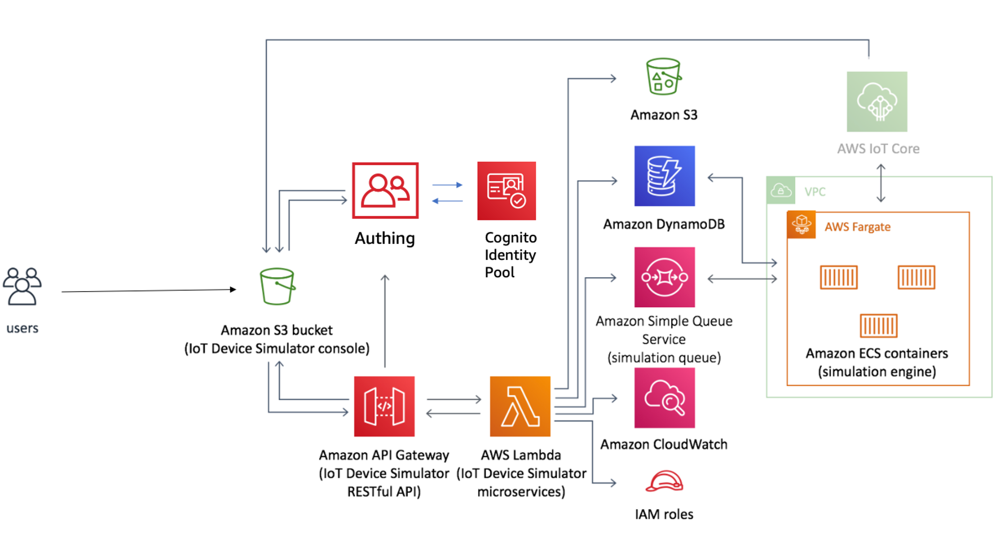

## 介绍
依赖于物联网相关及无服务器架构相关的服务可以很容易构建应用程序。这些应用程序可以在所连接的设备上进行数据的收集，处理，分析和操作，而无需管理任何基础架构组件。客户还可以为其物联网应用程序构建安全，灵活且可扩展的后端应用。这消除了客户开发和管理自己的后端应用资源的需求，并可以帮助降低成本，提高生产力和创新能力。但是，在没有大量物理连接设备的情况下测试物联网应用程序是一个挑战性的工作，需要投入大量的精力。

为了帮助客户更轻松地设备集成测试和物联网相关服务，我们提供了IoT Device Simulator解决方案。该解决方案提供了基于Web的图形用户界面（GUI）控制台，使客户能够创建和模拟数百个连接的设备，而无需配置和管理物理设备或开发耗时的脚本。该解决方案旨在开箱即用，或者可以将此解决方案用作参考架构实现，以针对特定的使用场景构建自定义仿真引擎。该解决方案提供了一个控制台，使用户可以从用户定义的设备类型构建大量虚拟设备，并模拟那些将数据定时的发布到物联网平台。您还可以使用该模拟器进行设备的监控，并能详细的观察到后端其他服务是如何处理相关数据的。

## 架构图


## 架构描述
AWS CloudFormation模板部署了设备模拟器API，该API利用Amazon API Gateway来调用AWS Lambda函数。这些Lambda 函数提供了用于在虚拟设备和设备类型上执行数据CRUD操作，记录相关模拟指标以及执行管理任务的业务逻辑。这些Lambda函数与Amazon Simple Storage Service（Amazon S3），Amazon DynamoDB，AWS身份和访问管理（IAM）和Amazon CloudWatch Logs交互以提供数据存储，管理和日志记录功能。

该解决方案还部署了一个包含两个公共子网和两个的私有子网的Amazon VPC网络拓扑。该模拟器引擎在由AWS Fargate提供的Amazon Elastic Container Service（Amazon ECS）容器中运行。 同时VPC还包括一个NAT网关。
该解决方案创建一个Web控制台，并将其部署到配置用于静态网站托管的Amazon S3存储桶中。另外初始化时创建一个默认的管理员角色，并向客户指定的用户电子邮件发送访问邀请。关于用户认证的部分，本方案使用Authing（https://authing.cn/ ）作为 OpenID 的提供商，用于用户的认证。从而实现对控制台和设备模拟器API的访问控制。首先需要进入系统后，点击登录按钮后，系统会转向到 authing.cn并提示输入用户和密码。当输入正确的用户名和密码后，会进入到主 页面。

关于业务逻辑方面，当设备模拟器API收到授权请求时，Amazon API Gateway会调用相应的Lambda函数。 Lambda函数将执行结果返回给API，API将结果返回给模拟器控制台。收到设备模拟请求后，设备微服务会将请求发送到Amazon Simple Queue Service（Amazon SQS）中的模拟队列。仿真引擎轮询仿真队列以获取仿真开始和停止请求。
最后当收到启动物联网设备请求后，系统将基于该请求生成虚拟设备。并在设备类型定义中的持续时间内，开始将模拟数据发布到已定义的AWS IoT端点。当用户每次点击该设备的启动按钮，所对应的模拟设备就会开始运行，直到定义的执行持续时间到期或收到停止请求为止。当收到停止模拟请求后，系统将根据该请求停止设备模拟，并在当前设备列表中所对应的设备进行状态更新。

## 组件
### 设备模拟器模块
物联网设备模拟器微服务是一系列AWS Lambda函数，为所有设备模拟操作提供业务逻辑和数据访问层。每个Lambda函数都采用AWS身份和访问管理(IAM)角色，具有最少的特权访问(所需的最低权限)来执行其指定的功能。
### 管理模块
Lambda函数 iot-sim-admin-service处理发送到 /admin/* API端点的设备模拟器API请求。所有 /admin/ * 的API端点都配置为Lambda代理端点，将完整的请求有效负载转发至iot-sim-admin-service函数。
### 度量指标模块
Lambda函数 iot-simple-metrics-service处理发送到 /metrics/* API端点的设备模拟器API请求。所有/metrics/* 的API端点都被配置为Lambda proxy端点 ，将完整的请求有效负载转发给iot- simple-metrics-service函数。度量指标模块处理物联网设备模拟器的所有度量指标操作。
### 设备管理模块
Lambda函数 iot-sim-device-service处理发送到 /device/* 端点的设备模拟器API请求。所有 /device/* API端点都配置为Lambda proxy端点，将完整的请求有效负载传递给iot-sim-device-service函数。设备管理模块所有设备和设备类型操作，包括设备列表、添加设备、删除设备、列表设备类型、添加设备类型、更新设备类型、启动模拟和停止模拟等操作。
### 设备仿真模块
本方案利用Amazon Simple Queue Service（Amazon SQS），Amazon Elastic Container Service（Amazon ECS）和AWS Fargate来模拟将数据发送到AWS IoT终端节点的虚拟设备。
用户通过该解决方案附带的Web控制台发出模拟请求。 系统将模拟请求添加到存储到Amazon SQS队列中，直到将其处理为止。
AWS Fargate 及Amazon ECS容器包含一个模拟引擎，该引擎会定期轮询模拟队列以获取模拟请求。 模拟引擎将启动虚拟设备，然后启动设备将模拟数据发布到AWS IoT终端节点。 在到达指定的持续时间之后，模拟引擎将停止模拟，终止虚拟设备，并更新iot-sim-device-widgets DynamoDB表中的设备状态和指标。
### 汽车模拟模块
另外该方案还包括汽车模拟模块，您可以使用该模块使用预定义的汽车类型来模拟车辆遥测数据。 该遥测数据来自动力总成仿真模型所生成的仿真数据。关于汽车在地图上位置的实时更新功能也是本模块所具有的功能，所使用的地图是利用Mapbox所提供的服务。 该功能的前提需要您注册一个免费的Mapbox开发人员帐户，并获得 访问令牌 (Access Token)。 在注册后，需要将该 Mapbox访问令牌添加到IoT设备模拟器。 
### 认证模块
该模块利用Authing.cn所提供的身份验证功能。 在用户身份验证成功后，Authing.cn将发布一个JSON Web Token (JWT) ，该令牌用于允许控制台将请求提交到设备模拟器API。 控制台将HTTPS请求与包含JWT令牌的授权标头一起发送到模拟器API。
### DynamoDB 表
该方案使用Amazon DynamoDB表保存设备，设备类型，设置和度量指标，以及相关的元数据。


## 定制化
* 设置你要生成 cloudformation template 所存储的 S3 存储桶名称
```
export DIST_OUTPUT_BUCKET=my-bucket-name # cloudformation template 所存储的 S3 存储桶名称
expodt SOLUTION_NAME=iot-device-simulator # 解决方案名称
export VERSION=my-version # 解决方案版本号
```
_Note:_ 您将必须创建一个前缀为“ my-bucket-name- <aws_region>”的S3存储桶； aws_region是您测试该解决方案的区域。 此外，存储桶中的文件应设置成公开。

* 构建步骤：
```
chmod +x ./build-s3-dist.sh \n
./build-s3-dist.sh $DIST_OUTPUT_BUCKET $SOLUTION_NAME $VERSION \n
```

* 把生成的 CloudFromation 模板文件复制到Amazon S3存储桶。 _注意：_您必须已安装AWS Command Line Interface。
```
aws s3 cp ./dist/ s3://my-bucket-name-<aws_region>/iot-device-simulator/<my-version>/ --recursive --acl bucket-owner-full-control --profile aws-cred-profile-name \n
```

* 获取上传到您的Amazon S3存储桶的iot-device-simulator-china.template的链接。
* 通过使用iot-device-simulator-china.template链接启动新的AWS CloudFormation堆栈，将IoT设备模拟器解决方案部署到您的帐户。

## 构建用于定制的仿真引擎Docker容器
模拟引擎是由AWS Fargate支持的Docker容器。 AWS Fargate调配的Amazon ECS容器包含模拟引擎，该引擎会定期轮询模拟队列以获取模拟请求。 仿真引擎提供了用于管理虚拟设备并生成仿真数据以发送到目标AWS IoT终端节点的逻辑。 在对仿真引擎进行自定义之后，您将需要构建一个新的Docker映像。
```
cd ./source/simulator
docker build -t <image-name> . \n
```

_Note:_ To install the AWS CLI and Docker and for more information on the steps below, visit the ECR [documentation page](http://docs.aws.amazon.com/AmazonECR/latest/userguide/ECR_GetStarted.html).

## 文件结构
物联网设备模拟器包括管理控制台，模拟引擎和API微服务，可简化解决方案的功能范围。
*管理控制台是SALAD（S3，API网关，Lambda和DynamoDB）应用程序。
*仿真引擎由AWS Fargate提供支持。
*微服务已部署到AWS Lambda中的无服务器环境。

```
|-deployment/
  |-buildspecs/                  [ solutions builder pipeline build specifications ]
  |-build-s3-dist.sh             [ shell script for packaging distribution assets ]
  |-run-unit-tests.sh            [ shell script for executing unit tests ]
  |-iot-device-simulator-china.yaml    [ solution CloudFormation deployment template ]
|-source/
  |-console/
    |-src/
      |-app/                     [ AngularJS 5 application ]
      |-assets/                  [ css, fonts, images and ui javascript libraries ]
      |-environments/            [ development and production environment configurations ]
  |-resources/
    |-authorizer                 [ Authorizer is a local package to create authentication and authorization claim ticket for solution services ]
    |- helper                    [ Helper is the AWS CloudFormation custom resource for aiding in the deployment of the solution ]
      |- lib/                    [ Helper libraries ]
    |- logger                    [ Logger is an auxiliary logging local package for solution services ]
    |- routes                    [ Predefined GeoJSON routes for vehicles in automotive module ]
    |- usage-metrics             [ Usage Metrics is an auxiliary local package to capture anonymous metrics pertinent for feedback on the solution ]
  |-services/
    |- admin                     [ Adminstration microservice ]
        |-lib/                   [ Administration microservice libraries ]      
    |- device                    [ Device microservice ]
        |-lib/                   [ Device microservice libraries ]      
    |- profile                   [ Profile microservice ]
        |-lib/                   [ Profile microservice libraries ]                                   
  |-simulator/
    |- helpers                   [ Helper resources for deployment ]
    |-lib/                       [ Simulation engine libraries ]
```

每个微服务都遵循以下结构：

```
|-service-name/
  |-lib/
    |-[service module libraries and unit tests]
  |-index.js [injection point for microservice]
  |-package.json
```

***

#### v1.1.0更改

```
*更改清单生成器以使用writeFileSync消除回调弃用错误
*向部署文件夹添加了开发模板[iot-device-simualtor.yaml]
* [新增]将Amazon CloudFront分配添加到模拟器控制台
* [新]为模拟器控制台Amazon S3存储桶设置Amazon CloudFront OAI限制性权限
* [新]更新了登录到Amazon CloudFront分发域的用户邀请电子邮件的登录URL
* [新增]添加了新的设备类型属性`DEVICE ID'，该属性为模拟中每个生成的设备常数提供了静态唯一标识符。
* [新增]通过在给定页面上选择多个设备并“一键启动”多个设备的模拟，从而增加了批量启动设备的功能
* [新增]从VeriSign AWS IoT端点迁移到ATS AWS IoT端点
```

#### v1.0.1更改

```
*添加了在默认情况下不是vpc的旧版帐户中创建弹性IP的修复程序
*添加了对管理微服务IAM策略的修复，以包括通过模拟器控制台管理用户所需的所有权限
```

#### v2.0.0更改

```
* [新增]添加了新的数据生成算法：正弦波和衰减
* [新增]为设备类型有效负载的嵌套（JSON）对象（最多3个深度）添加了新的属性类型
* [新增]增加了在同一安装的用户之间共享设备模板的功能

```

#### v2.1.1更改

```
* Lambda运行时更新为Node.js 12
*启用CloudFront分发访问日志
*启用S3访问日志
* S3存储桶上拒绝公共访问和公共ACL
*使用AWS默认密钥为S3和SQS启用静态加密
* Docker构建映像已在ECR上更新为Node.js 12
```

#### v2.1.1 中国版本定制化
```
* 使用 Authing.cn 作为 OpenID provider， 提供用户认证的功能
* 增加新 lambda 函数认证 JWT token
* 界面中文化
```

***

Copyright 2019 Amazon.com, Inc. or its affiliates. All Rights Reserved.

Licensed under the Apache License, Version 2.0 (the "License"). You may not use this file except in compliance with the License. A copy of the License is located at

http://www.apache.org/licenses/LICENSE-2.0 
or in the "license" file accompanying this file. This file is distributed on an "AS IS" BASIS, WITHOUT WARRANTIES OR CONDITIONS OF ANY KIND, either express or implied. See the License for the specific language governing permissions and limitations under the License.